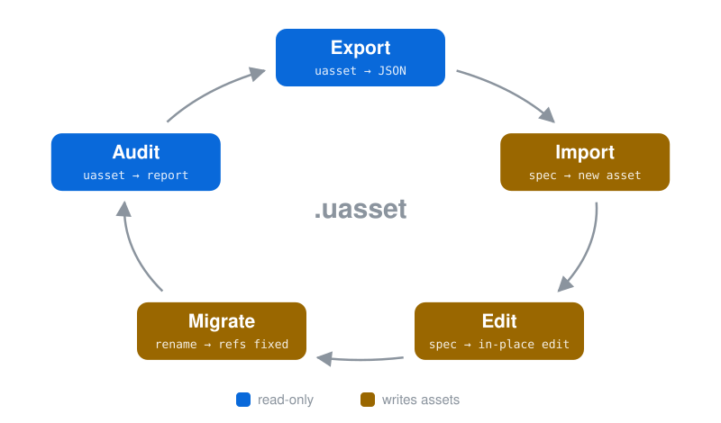

# uasset-workbench

[English](README.md) | **中文** | [Version](Version.md)


让脚本与 AI agent 读、写、改、审 Unreal Engine 5 uasset 的编辑器插件。

## 它解决什么问题

<div align="center">

| 问题 | 现状 | 能力 |
| :-- | :-- | :-: |
| 读不了 | `.uasset` 是二进制，图、时间轴、控件层级、参数只在编辑器界面里看得到 | Export |
| 改不了 | UMG 布局只能在编辑器里手工拖，没有可版本控制、可重放的写入路径 | Import |
| 改不动既有的 | 加组件、接线、设默认值要分三次手工改，一批蓝图就重复一批次 | Edit |
| 改名后修不了 | CoreRedirects 修不到 Blueprint 图里的实现侧与消费侧，也修不到 level 的旧路径 | Migrate |
| 审计不了 | 破损引用、贴图压缩、材质 usage flag、level 组件预算，没有批量查询的入口 | Audit |

</div>

## 五组能力

<p align="center">
  
</p>

- **闭环**: 多数 Export 产物改完就是 Import 与 Edit 的 spec，Audit 报告的 `Spec` 块直接喂给 Edit
- **编辑器开着**: 在编辑器进程内执行，每次运行在 Message Log 留一页，不用为导出关编辑器
- **编辑器关着**: 起 commandlet 执行，只读的 Export 与 Audit 照常可用，写入组要等编辑器开着
- **写入**: 按资产全有或全无，编译不过的 Blueprint 不会保存，Edit 组默认 dry run

## 支持的资产

<div align="center">

| 资产 | Export | Import | Edit | Migrate | Audit |
| :-- | :-: | :-: | :-: | :-: | :-: |
| Blueprint | ✓ | | ✓ | ✓ | |
| Widget Blueprint | ✓ | ✓ | ✓ | ✓ | |
| Anim Blueprint | ✓ | | ✓ | ✓ | |
| AnimSequence / AnimMontage | ✓ | | ✓ | | |
| DataTable | ✓ | | ✓ | | |
| DataAsset | ✓ | ✓ | | | |
| Material / MaterialInstance | ✓ | | ✓ | | ✓ |
| Texture | ✓ | | ✓ | | ✓ |
| Niagara System | ✓ | | | | |
| Behavior Tree | ✓ | | | | |
| Level | ✓ | | ✓ | ✓ | ✓ |
| PCG Graph | ✓ | | ✓ | | ✓ |
| 任意资产 | | ✓ | | ✓ | |

</div>

任意资产: `CreateAsset` 按 spec 新建，`RenameAsset` / `DuplicateAsset` / `ResaveAsset` 改名、复制、重存

每格对应的 RunName: [Docs/AI-Guide.md](Docs/AI-Guide.md) 的决策表

## 快速开始

**1. 装进项目**

把 `src/` 复制到项目的 `Plugins/UAssetWorkbench/`，在 `.uproject` 的 `Plugins` 数组加一项，重新生成工程文件并编译。

```json
{ "Name": "UAssetWorkbench", "Enabled": true }
```

前置: Unreal Engine 5.7，插件随项目编译

**2. 调用**

编辑器开着关着都走同一个 wrapper。

```bash
UE="<UE_PATH>"
PROJECT="<PROJECT_DIR>/MyProject.uproject"
RUN="Plugins/UAssetWorkbench/scripts/run_commandlet.sh"
export MSYS_NO_PATHCONV=1   # Git Bash 下防止 /Game/... 被改写成 Windows 路径

# Export: Blueprint 图导出 JSON
bash "$RUN" "$UE" "$PROJECT" BlueprintEdGraphExport "/Game/Blueprints/BP_Foo"

# Import: 按 spec 重建控件树
bash "$RUN" "$UE" "$PROJECT" WidgetLayoutImport "" 10 600 '-spec="C:/temp/WBP_Foo.spec.json"'

# Edit: 按 spec 改 Blueprint，-apply 才落盘
bash "$RUN" "$UE" "$PROJECT" EditBlueprint "" 10 600 '-spec="C:/temp/BP_Foo.edit.json" -apply'

# Migrate: C++ 事件改名后，把 BP override 接回新事件
bash "$RUN" "$UE" "$PROJECT" RedirectBlueprintEvent "/Game/Blueprints/BP_Foo" 10 600 \
    '-OwnerClass="/Script/MyModule.MyActor" -OldEvent="OnPickedUp" -NewEvent="HandlePickedUp"'

# Audit: 检查全部贴图的构建设置
bash "$RUN" "$UE" "$PROJECT" AuditTexture "" 10 600 '-scandir="/Game"'
```

参数说明: `run_commandlet.sh` 文件头

Export 产物: `Intermediate/UAssetExport/<AssetPath>_r<revision>_<时间戳>.json`

## 给 AI agent 用

<div align="center">

| 文档 | 内容 |
| :-- | :-- |
| [Docs/AI-Guide.md](Docs/AI-Guide.md) | 入口，决策表、调用模板、常见坑 |
| [Docs/Export.md](Docs/Export.md) | 每个导出的 JSON 字段 |
| [Docs/Import.md](Docs/Import.md) | spec 格式 |
| [Docs/Edit.md](Docs/Edit.md) | 每个 spec key 与 op |
| [Docs/Migrate.md](Docs/Migrate.md) | 改名后的修复步骤 |
| [Docs/Audit.md](Docs/Audit.md) | 规则表与 stream metric 工作流 |

</div>

## 为什么不依赖官方工具链

官方给 AI 与自动化的入口，MCP、Remote Control、Python API，随引擎版本演进，能力有空窗，个别编辑器子系统会在特定版本回归。

workbench 只用 commandlet 与引擎稳定 API，产出是可版本控制、可 diff、可重放的 JSON。官方没提供的机制，加一个 commandlet 就补上。

在线交互方案解决的是另一类问题，场景搭建、PIE 调试、即时调参，两者不互斥。

## 泛化

UE 只是验证场，三样可复用的东西不依赖它。

| 可复用的东西 | 是什么 | 可迁移到 |
| --- | --- | --- |
| 模式 | 不透明二进制与 AI 可读结构化文本之间的双向桥 | 任何被 GUI 锁住的专有格式，DCC / CAD / BIM / EDA / 仿真 |
| 架构 | heartbeat 路由的自适应双管线，live 进程内与 headless 两条路产出一致 | 任何同时有交互模式与无头模式的重型宿主，Houdini / Maya / Blender / Revit / MATLAB |
| 序列化纪律 | 顾及 token 成本的导出，与 archetype 求差、超量采样截断、grep 加区间读的读取契约 | 任何 LLM 数据管线的上下文工程 |

## License

[MIT](LICENSE) - Hyrex Chia
